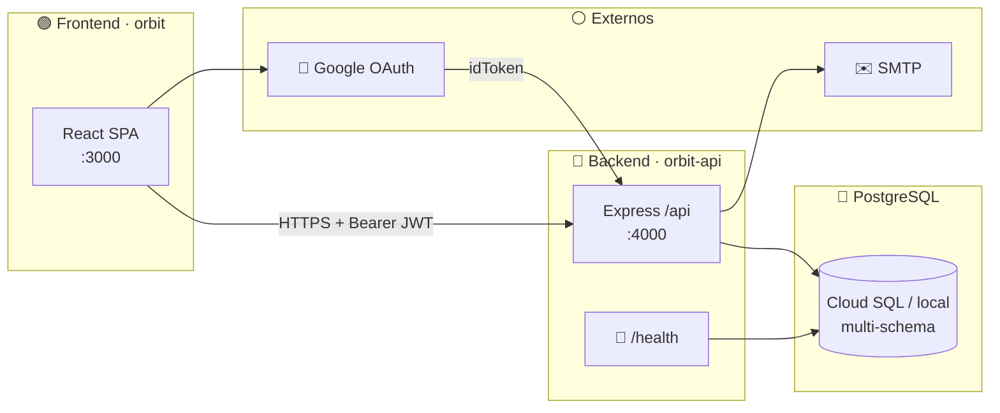
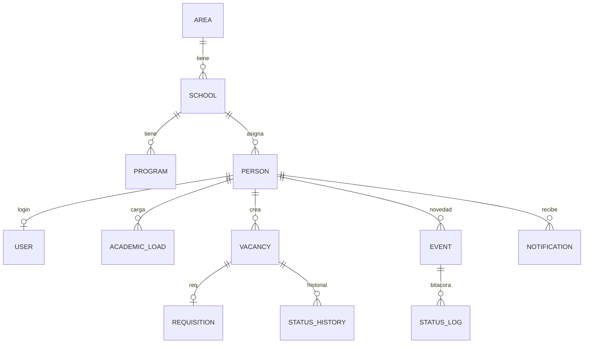

<div align="center">


# Orbit — Documentación completa

**Plataforma interna CUN** · operación académica y de planta

[](orbit/)
[](orbit-api/)
[](#6--base-de-datos)
[](#11--despliegue)

| | |
|:--|:--|
| 🖥️ **Frontend** | https://orbit-frontend-526995286786.us-central1.run.app |
| ⚙️ **Backend** | https://orbit-backend-526995286786.us-central1.run.app |
| ☁️ **GCP** | `it-fab-contenido-edu-6` · `us-central1` |

**Paleta de marca:** `violet` · `fuchsia` · `cyan`

</div>

---

## 📑 Tabla de contenidos

| | Sección |
|:-:|:--------|
| 🎯 | [1. Visión general](#1--visión-general) |
| 📁 | [2. Estructura del monorepo](#2--estructura-del-monorepo) |
| 🏗️ | [3. Arquitectura](#3--arquitectura) |
| ⚛️ | [4. Frontend](#4--frontend-orbit) |
| 🟢 | [5. Backend](#5--backend-orbit-api) |
| 🗄️ | [6. Base de datos](#6--base-de-datos) |
| 🔐 | [7. Autenticación y autorización](#7--autenticación-y-autorización) |
| 🧩 | [8. Variables de entorno](#8--variables-de-entorno) |
| 🚀 | [9. Arranque local](#9--arranque-local) |
| 🧬 | [10. Migraciones, seeds y scripts](#10--migraciones-seeds-y-scripts) |
| ☁️ | [11. Despliegue](#11--despliegue) |
| 📚 | [12. Documentación relacionada](#12--documentación-relacionada) |
| 🛠️ | [13. Stack](#13--stack) |

---

## 1. 🎯 Visión general

Orbit concentra en un solo producto:

| Icono | Módulo UI | Color | Qué resuelve |
|:-----:|-----------|:-----:|--------------|
| ⚡ | **Command Center** |  | Métricas: docentes, vacantes, contrataciones, aging, novedades del día |
| 🏢 | **Planta Activa** |  | Maestro de personas; alta/edición; inactivar puede abrir vacante |
| 🎓 | **Carga Académica** |  | Proyección ACA (docente × materia × grupo × periodo) |
| ⏱️ | **Balance carga** |  | Horas sustantivas y preparación de clase |
| 💼 | **Vacantes** |  | Ciclo operativo + REQ + notas + Excel + notificaciones |
| 🛡️ | **Panel informativo** |  | Bitácora / audit de vacantes (capability + feature flag) |
| 💬 | **Novedades** |  | Eventos de fuerza laboral + bitácora de estados |

> 💡 El **backend** es la fuente de verdad. El frontend **no usa React Router**: navega por estado React (`View`) y llama al API con JWT.

---

## 2. 📁 Estructura del monorepo

```text
Orbit/
├── 📘 README.md                      # Este documento
├── 🔗 LOGIN_APPS_INTEGRATION.md      # Log central de logins
├── 📂 docs/
│   └── 📋 ANS-vacantes.md
├── ☁️ gcp/                           # Deploy Cloud Run / Cloud Build
├── ⚛️ orbit/                         # Frontend SPA (violet)
│   ├── src/components/views/         # Pantallas
│   ├── src/components/layout/        # Sidebar, TopBar, campana…
│   ├── src/lib/                      # api, permissions, helpers
│   └── src/config/brand.tsx          # Logos + colores + iconos
└── 🟢 orbit-api/                     # Backend API (fuchsia)
    ├── src/routes/                   # Routers HTTP
    ├── src/middleware/               # JWT + capabilities
    ├── src/db/                       # connection, migrate*, seed*
    ├── src/services/                 # Notify, Excel, bulk
    └── docs/                         # auth-google, carga-académica
```

---

## 3. 🏗️ Arquitectura



### 🔄 Flujo de sesión

| Paso | Icono | Qué ocurre |
|:----:|:-----:|------------|
| 1 | 👤 | Login Google `@cun.edu.co` en el SPA |
| 2 | 🎫 | Frontend envía `idToken` → `POST /api/auth/google` |
| 3 | ✅ | API verifica, busca `person`, allowlist/grants, firma JWT |
| 4 | 💾 | SPA guarda `orbit_jwt` + `orbit_user` en `localStorage` |
| 5 | 🔁 | Cada `/api/*` revalida auth + capabilities |
| 6 | 🧭 | UI filtra menú y pantallas según capabilities |

🔔 **Notificaciones:** al crear vacante → `orbit.notification` + email SMTP (si hay credenciales). La campana hace polling del unread.

---

## 4. ⚛️ Frontend (`orbit/`)

### 4.1 Stack y build

| Icono | Capa | Tecnología |
|:-----:|------|------------|
| ⚛️ | UI | React 19 + TypeScript |
| ⚡ | Build | Vite 6 |
| 🎨 | Estilos | Tailwind CSS 4 |
| 🔐 | Auth UI | `@react-oauth/google` |
| 🦸 | Iconos | `@heroicons/react` |
| ✨ | Motion | `motion` |
| 🧲 | DnD | `@dnd-kit/*` |

- Alias `@` → raíz del frontend
- ❌ Sin `server.proxy` → llamadas directas a `VITE_API_URL`
- 🚀 Dev: puerto **3000** · host `0.0.0.0`

### 4.2 Bootstrap y “routing”

> ⚠️ **No usa React Router.** Navegación = `useState<View>` en `App.tsx`.

1. `main.tsx` → `GoogleOAuthProvider` → `App`
2. Vista inicial: `login`
3. JWT válido → restaura sesión
4. Login OK → shell + tutorial
5. Vista no permitida → `getDefaultView(capabilities)`
6. Vacante detalle → `selectedVacancy` + `vacancy-detail`

### 4.3 Vistas de negocio

#### Menú lateral (`NAV_ITEMS`)

| | View id | Componente | Descripción |
|:-:|---------|------------|-------------|
| ⚡ | `home` | `HomeView` | Command Center + `GET /dashboard/summary` |
| 🏢 | `planta-activa` | `PlantaActivaView` | Personas; filtros; grants por área |
| 🎓 | `academic-load` | `AcademicLoadView` | Carga académica (lectura) |
| ⏱️ | `substantive-hours` | `SubstantiveHoursView` | Balance de carga |
| 💼 | `vacancies` | `VacanciesView` | Vacantes + chart + Excel |
| 🛡️ | `vacancy-informative-panel` | `VacancyInformativePanelView` | Audit (feature flag) |
| 💬 | `news` | `NewsView` | Novedades / workforce |

#### Otras vistas

| | View id | Notas |
|:-:|---------|-------|
| 🔑 | `login` | Google + email local (dev) |
| 📄 | `vacancy-detail` | Detalle, historial, admin |
| 🔓 | `reinstatements` | Reintegros |
| 📜 | `audit` | Mock / legacy |
| 📚 | `programs` | Demo |

### 4.4 Layout

| Icono | Componente | Rol |
|:-----:|------------|-----|
| 📌 | `Sidebar` | Nav filtrada; expand/collapse; drawer móvil |
| 🔝 | `TopBar` | ⌘/Ctrl+K, tutorial, campana, logout |
| 🏷️ | `Header` | Título / acciones de página |
| 🔍 | `CommandPalette` | Búsqueda vistas + personas + vacantes |
| 🔔 | `NotificationBell` | Poll ~60s; deep-link a vacante |

### 4.5 `lib/` y permisos UI

| Archivo | Rol |
|---------|-----|
| 🌐 `api.ts` | Cliente HTTP + sesión JWT + endpoints |
| 🛂 `permissions.ts` | Capabilities, gating de vistas, landing |
| 🏢 `plantaActivaAccess.ts` | Grants por correo (áreas) |
| 💼 `vacancyFormHelpers.ts` | Labels, bloqueos, Zoho REQ |
| 📅 `vacancyActiveDays.ts` | Días activos (Bogotá) |
| 💬 `workforceEventLabels.ts` | Labels/badges de novedades |
| 🎨 `config/brand.tsx` | Logos, colores, mapa de iconos |

💾 Sesión: `orbit_jwt`, `orbit_user`. Ante **401** → limpia sesión.

### 4.6 Login en UI

| Modo | Badge | Flujo |
|------|:-----:|-------|
| Google |  | `GoogleLogin` → `POST /auth/google` |
| Email local |  | Visible si `DEV` o `VITE_ALLOW_LOCAL_EMAIL_LOGIN` |

### 4.7 Tipos principales

`View` · `PlantaPerson` · `Vacancy` / `VacancyDetail` · `VacancyOperationStatus` · `OrbitNotification` (+ tipos en `lib/api.ts`)

---

## 5. 🟢 Backend (`orbit-api/`)

### 5.1 Entry point

Orden de montaje:

| # | Capa | Notas |
|:-:|------|-------|
| 1️⃣ | `cors()` | Permisivo por defecto |
| 2️⃣ | `express.json()` | Body JSON |
| 3️⃣ | 🔓 `authRouter` | Público |
| 4️⃣ | 🔐 `orbitAuthMiddleware` | JWT |
| 5️⃣ | 🛂 `orbitCapabilityByPathMiddleware` | Capability por path |
| 6️⃣ | 📦 Routers de negocio | Bajo §5.3 |

- 💚 **`GET /health`** — sin auth · DB OK `200` / fail `503`
- 🩹 Boot: `runStartupSchemaPatches()` (idempotente)
- 🔌 Puerto: `PORT` o **4000**

### 5.2 Middleware de auth

**Token:** `Authorization: Bearer` · GET también `?access_token=`

**Reborn:** capabilities se **recalculan por email** en cada request (allowlist / planta / vacancy-admin).

| Prefijo | Capability |
|---------|------------|
| `/catalog` | ✅ autenticado |
| `/dashboard` | `view:home` |
| `/planta-activa` | `view:planta_activa` |
| `/vacancies`, `/reinstatements` | `view:vacancies` |
| `/academic-load` | `view:academic_load` |
| `/substantive-hours` | `view:substantive_hours` |
| `/workforce-events` | `view:news` |
| `/personal` | `view:news` u `view:home` |
| `/notifications` | solo auth |

Sin capability → 

### 5.3 Endpoints por dominio

Leyenda HTTP:


Prefijo **`/api`** (salvo `/health`).

#### 🔑 Auth — sin JWT

| Método | Path | Propósito |
|--------|------|-----------|
|  | `/auth/google` | `{ idToken }` → `{ token, user }` |
|  | `/auth/google/gis-callback` | Redirect GIS |
|  | `/auth/local-email` | Solo DEV / flag |

#### ⚡ Dashboard · 📂 Catálogo

| Método | Path | Propósito |
|--------|------|-----------|
|  | `/dashboard/summary` | Métricas home |
|  | `/catalog/areas` · `schools` · `programs` · `roles` · `academic-lines` | Catálogos CORE |

#### 🏢 Planta · 💬 Novedades · 🔔 Notificaciones

| Método | Path | Propósito |
|--------|------|-----------|
|    | `/planta-activa` | CRUD personas (+ vacante al inactivar) |
|    | `/workforce-events/...` | Eventos + status-log |
|   | `/notifications...` | Campana in-app |

#### 💼 Vacantes

| Método | Path | Propósito |
|--------|------|-----------|
|  | `/vacancies` · `/:id` · `/export.xlsx` · `/audit-log` | Listado / detalle / Excel / audit |
|  | `/vacancies` · notes · requisition | Crear + notify |
|  | `/:id` · `/close` · `/admin-status` | Update / cierre / admin |
|  | `/:id` | Eliminar (`vacancies:admin`) |

También: 🔓 reintegros · 🎓 carga académica · ⏱️ horas sustantivas.

### 5.4–5.5 Libs y services

| Tipo | Módulos |
|------|---------|
| 🧠 Libs | `orbitCapabilities` · `plantaActivaAccess` · `orbitRoles` · `newsScope` · `schoolScope` · `coreSchema` |
| 🛎️ Services | `vacancyNotify` · email template · Excel export · bulk catalog/workload (scripts) |

### 5.6 Import / Excel

- ✅ Export HTTP: `/vacancies/export.xlsx`
- ❌ Sin upload HTTP en routers actuales
- 📜 Scripts offline en `scripts/` + seeds Excel

### 5.7 Errores HTTP

| Código | Color | Uso |
|:------:|:-----:|-----|
| 400 |  | Validación |
| 401 |  | JWT / no autorizado |
| 403 |  | Sin capability |
| 404 |  | No encontrado |
| 409 |  | Conflicto |
| 500 |  | Error interno |
| 503 |  | Health / CORE down |

---

## 6. 🗄️ Base de datos

PostgreSQL · Cloud SQL (socket `/cloudsql/...` o TCP + SSL).

### 6.1 Conexión

| Variable | Rol |
|----------|-----|
| `DB_HOST` / `DB_PORT` | Host o socket · default `5432` |
| `DB_USER` · `DB_PASSWORD` · `DB_NAME` | Credenciales |
| `DB_SCHEMA` | Primer schema del `search_path` |
| `DB_SSL` · timeouts · `DB_POOL_MAX` | TLS y pool (`pg.Pool`) |

### 6.2 Esquemas (leyenda de color)

| Color | Schema | Dominio |
|:-----:|--------|---------|
|  | `core` | Catálogo + personas |
|  | `academic_workload` | Materias, grupos, carga |
|  | `substantive_hours` | Horas / categorías |
|  | `vacancies` | Vacantes + REQ + audit |
|  | `workforce_events` | Novedades |
|  | `orbit` | Notificaciones |
|  | `logs` | Imports + login apps |
|  | `public` | Tablas antiguas |

> 📌 Dump SQL ≈ `core` + `academic_workload` + `logs` + `substantive_hours`.  
> `vacancies` · `workforce_events` · `orbit` llegan por migraciones.

### 6.3–6.8 Tablas por dominio

**🟣 CORE** — `area` · `school` · `program` · `role` · `person` ⭐ · `user` · `city` · `contract_type` · `hierarchy` · `person_program_assignments`

**🔵 Carga** — `subject` · `class_group` · `class_preparation` · `academic_load`

**🩵 Horas** — `category` · `assignment` · `assignment_task`

**🟠 Vacantes** — `vacancy` · `requisition` · `vacancy_operation_note` · `vacancy_status_history` · `vacancy_change_log`

**🟢 Novedades** — `event_type` · `event` · `event_status_log`

**🩷 / ⬜** — `orbit.notification` · `logs.logs_orbit_docentes` · `logs.login_apps`

### 🟠 Pipeline de estados — Vacantes

| Estado | Badge |
|--------|-------|
| `open` |  |
| `selected` |  |
| `requisition_sent` |  |
| `internal_movement` |  |
| `hired` |  |
| `closed` |  |
| `cancelled` |  |
| `cancelled_by_capital` |  |

```text
open → selected → requisition_sent → internal_movement
                                          ↓
                         hired | closed | cancelled | cancelled_by_capital
```

### 🟢 Estados — Novedades (workforce)

| Badge | Estado |
|:-----:|--------|
|  | Pendiente |
|  | Aprobado |
|  | Rechazado |
|  | Tomado |
|  | No tomado (default) |
|  | Cancelado |

Tipos seed: `LICENCIA` · `PERMISO` · `SANCION` · `INCAPACIDAD` · `OTRO`

### 6.10 Diagrama conceptual



---

## 7. 🔐 Autenticación y autorización

### 7.1 Capabilities

| Capability | Icono | Módulo |
|------------|:-----:|--------|
| `view:home` | ⚡ | Command Center |
| `view:planta_activa` | 🏢 | Planta Activa |
| `view:academic_load` | 🎓 | Carga académica |
| `view:substantive_hours` | ⏱️ | Balance carga |
| `view:vacancies` | 💼 | Vacantes / reintegros |
| `vacancies:informative_panel` | 🛡️ | Panel informativo |
| `vacancies:admin` | 👑 | Eliminar / forzar estado |
| `view:news` | 💬 | Novedades |

### 7.2 Modelo reborn

Puede entrar quien esté en:

1. 👑 `ORBIT_ACCESS_ALLOWLIST` — admin total  
2. 🏢 Grant Planta Activa (`plantaActivaAccess.ts`)  
3. 💼 `ORBIT_VACANCY_ADMIN_ALLOWLIST`

📘 Detalle: [`orbit-api/docs/auth-google.md`](orbit-api/docs/auth-google.md)

### 7.3 JWT

🎫 Firmado con `JWT_SECRET` · expira a las **2 horas** · middleware **recalcula** capabilities por email.

---

## 8. 🧩 Variables de entorno

### ⚛️ Frontend (`.env.local`)

| Variable | Uso |
|----------|-----|
| `VITE_API_URL` | Base API |
| `VITE_GOOGLE_CLIENT_ID` | OAuth |
| `VITE_ALLOW_LOCAL_EMAIL_LOGIN` | Login email fuera de DEV |
| `VITE_ORBIT_*_ALLOWLIST` | Caps extra en cliente (opcional) |

### 🟢 Backend (`.env`)

| Grupo | Variables |
|-------|-----------|
| 🗄️ DB | `DB_HOST` · `DB_PORT` · `DB_USER` · `DB_PASSWORD` · `DB_NAME` · `DB_SCHEMA` · `DB_SSL` |
| 🔐 Auth | `GOOGLE_CLIENT_ID` · `JWT_SECRET` · `ORBIT_*` · `ALLOW_LOCAL_EMAIL_AUTH` |
| 🌐 App | `PORT` · `ORBIT_FRONTEND_URL` · `CORS_ORIGIN` |
| ✉️ Mail | `SMTP_*` · `VACANCY_NOTIFY_EMAILS` |

⚠️ **Nunca** commits de `.env` reales ni passwords.

---

## 9. 🚀 Arranque local

### 🟢 Backend

```powershell
cd orbit-api
copy .env.example .env
# Completar DB_*, GOOGLE_CLIENT_ID, JWT_SECRET, ORBIT_FRONTEND_URL
npm install
npm run dev   # → :4000
```

💚 Salud: `curl http://127.0.0.1:4000/health`

### ⚛️ Frontend

```powershell
cd orbit
copy .env.example .env.local
# VITE_API_URL=http://localhost:4000/api
npm install
npm run dev   # → :3000
```

🌐 Abrir http://localhost:3000

---

## 10. 🧬 Migraciones, seeds y scripts

| Script | Efecto |
|--------|--------|
| `migrate` / `v2` / `v3` | Legacy `public` |
| `migrate:core` | 🟣 Catálogo CORE |
| `migrate:vacancies*` | 🟠 Schema vacantes |
| `migrate:workforce-events` | 🟢 Novedades |
| `migrate:notifications` | 🩷 Campana |
| `migrate:audit` / `login-apps` | ⬜ Logs |
| `migrate:substantive-hours-*` | 🩵 Horas |
| `migrate:academic-load-aca-group-id` | 🔵 `aca_group_id` |

🩹 Boot: `startupSchemaPatches.ts`  
🌱 Seeds `seed`…`seed:v4` → tablas **legacy**  
🧪 `npm test` · `test:smtp` · `template:person`

---

## 11. ☁️ Despliegue

```powershell
.\gcp\deploy-orbit-backend.ps1
.\gcp\deploy-orbit-frontend.ps1
# o ambos:
.\gcp\deploy-orbit-all.ps1
```

| | |
|:-:|:--|
| ⚛️ | Frontend Cloud Run |
| 🟢 | Backend Cloud Run |
| 🔐 | Secrets en Secret Manager |
| 📘 | Checklist: [`orbit-api/README_DEPLOY.md`](orbit-api/README_DEPLOY.md) |

---

## 12. 📚 Documentación relacionada

| Icono | Documento | Tema |
|:-----:|-----------|------|
| 🔐 | [auth-google.md](orbit-api/docs/auth-google.md) | Login, JWT, capabilities |
| 🎓 | [carga-academica.md](orbit-api/docs/carga-academica.md) | Modelo BI carga |
| 📊 | [ESTADO_PROYECTO.md](ESTADO_PROYECTO.md) | Estado general y porcentaje de avance |
| 👥 | [second-in-command.md](orbit-api/docs/second-in-command.md) | Segundos al mando |
| 📋 | [ANS-vacantes.md](docs/ANS-vacantes.md) | ANS vacantes |
| ☁️ | [README_DEPLOY.md](orbit-api/README_DEPLOY.md) | Deploy Cloud Run |
| 🔗 | [LOGIN_APPS_INTEGRATION.md](LOGIN_APPS_INTEGRATION.md) | Logins centrales |
| ⚛️ | [orbit/README.md](orbit/README.md) | Frontend corto |

---

## 13. 🛠️ Stack

| Capa | Badge | Tecnologías |
|------|:-----:|-------------|
| Frontend |  | React 19 · Vite 6 · TS · Tailwind 4 · Motion · Google OAuth |
| Backend |  | Express · TS · pg · JWT · ExcelJS · Nodemailer |
| Database |  | PostgreSQL · Cloud SQL · multi-schema |
| Infra |  | Cloud Run · Cloud Build · Secret Manager |

---

<div align="center">

**Orbit** · violet · fuchsia · cyan

*Documento vivo del monorepo. Actualiza esta guía junto con cambios de API, schema o acceso.*

</div>
